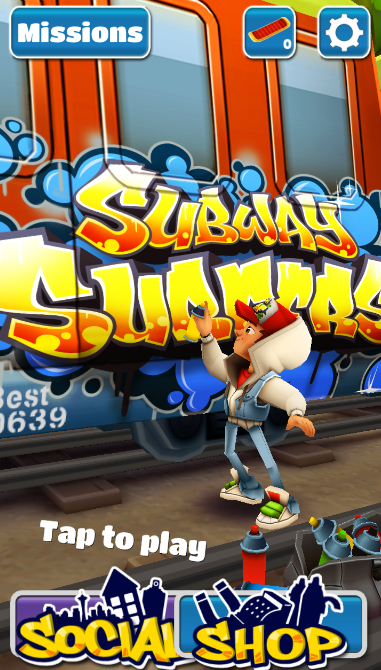
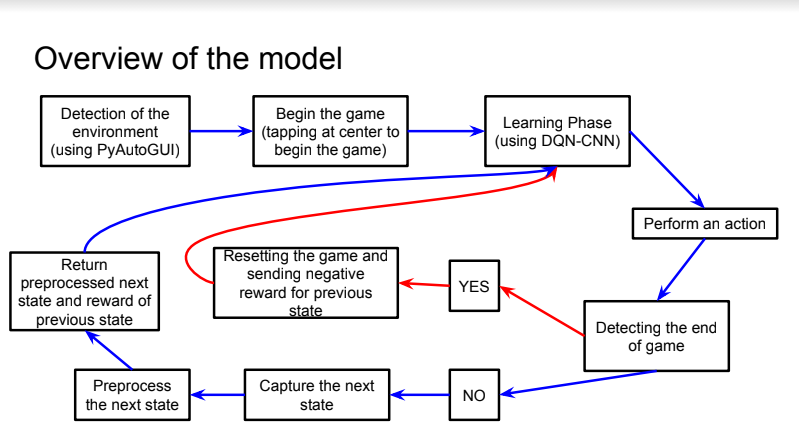

# Solving Subway Surfers using Reinforcement Learning
## Problem description
The problem is to train an agent to play the Subway Surfers game using DQN-CNN based Reinforcement Learning.

#### What is Subway Surfers?
https://subwaysurfers.com/

A user controlled agent runs on railway tracks and a cop chases it. It can’t stop and needs to run endlessly otherwise it will get caught. It has 4 possible moves - to go left, right, jump up and roll down to avoid upcoming obstacles including moving/static trains and barriers.

## Our Solution
Our project emphasizes on training the agent (runner) to learn and play the game. Agent detects the obstacles with the use of the input image and tries to make suitable moves, just like an ordinary human player would based on the environment.

We came to the conclusion to use Q-learning variants, in particular, due to the fact that the game we are trying to learn had discrete action spaces with near-zero tolerance for errors.

We have used DQN based reinforcement learning algorithm along with CNN with some modifications (Experience replay, LSTM & Eligibility Trace).

## Results

Despite of very less training our model learnt to dodge some obstacles and achieve an average score of around 250 (high score of 512).
During training for some epochs it learnt to keep jumping or rolling as the agent is not penalized for these actions and sometimes it helps to dodge some obstacles. 
For better results the model require more training.

## Requirements
 -  NoxStudio
 -  PyAutoGUI
 -  Subway Surfers v1.0 (Install the given APK in the android emulator)
 -  OpenCV
 -  Matplotlib
 -  Numpy
 -  sklearn
 -  PyTorch

## Instructions to replicate our model:
 -  Download the .zip file and extract the contents to a folder.
 -  Follow the readme present in install folder.
 -  Make the folder as your current directory in cmd or any other console that you are using. (For this project we prefer to use pyTorch)
 -  Launch Nox and run subway surfers in it.
 -  Then run the code(ai.py) and Subway Surfer should be running on Nox Player such that the whole screen of Nox Player is visible while running the code.
 -  Don't alter the folder structure.
 -  Don't disturb the mouse once you run the code.
 -  To exit the game try to bring the cursor out of the game window.

## References:

 -  https://www.cs.toronto.edu/~vmnih/docs/dqn.pdf
 -  https://www.linkedin.com/pulse/understanding-intelligence-one-pixel-time-aamir-mirza/
 -  https://towardsdatascience.com/an-exploration-of-neural-networks-playing-video-games-3910dcee8e4a
 -  https://www.superdatascience.com/pages/artificial-intelligence
 -  https://towardsdatascience.com/reinforcement-learning-for-mobile-games-161a62926f7e
 -  https://github.com/opherlieber/rltime/issues/1
 -  https://medium.com/@SmartLabAI/reinforcement-learning-algorithms-an-intuitive-overview-904e2dff5bbc
 -  https://www.udemy.com/course/artificial-intelligence-az/
 -  https://medium.com/emergent-future/simple-reinforcement-learning-with-tensorflow-part-8-asynchronous-actor-critic-agents-a3c-c88f72a5e9f2
